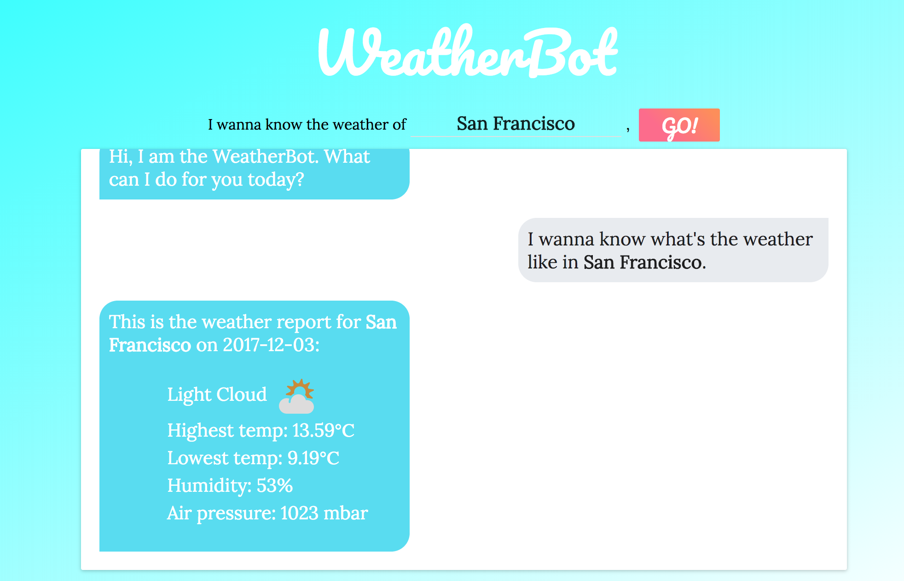

NimblyChallenge (or Nibucha)
---

### Introduction
Developed with React and Redux, the projects creates a simple UI for weather querying.

### Source Files
```
src
├── MetaWeatherAPI
│   └── queries.js
└── data-flow
    └── ActionTypes.js
    └── Actions.js
    └── Reducer.js
    └── Store.js
├── view
│   └── ...
    
```

- `MetaWeatherAPI` contains the wrapper methods for querying MetaWeather's API. *Note* that `MetaWeather` does not support CORS thus a CORS-proxy server was used.

- `data-flow` contains Redux-based data control schemes.
- `view` contains React components that render interactive view, dispatch requests, and trigger data flow.


### Usage

#### install
```sh
$ git clone https://github.com/shuchenliu/NimblyChallenge.git
$ cd NimblyChallenge
$ npm install
```

#### Run & test

```sh
$ npm start
```

#### Build

```sh
$ npm run build
```

### Demo
[The Weatherbot](https://weatherbot-react.herokuapp.com/)  
<br>



### Credits

This app was bootstrapped with [Create React App](https://github.com/facebookincubator/create-react-app).

API Source: [MetaWeather](https://www.metaweather.com/api/)
